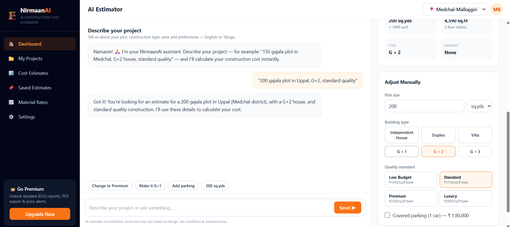

# 🏗️ NirmaanAI — AI Construction Cost Estimator

**Know your construction cost in 60 seconds.** AI-powered construction cost estimates for home builders in Telangana, with hyperlocal district-level pricing and a conversational interface in English or Telugu.

**Live demo:** https://nirmaanai.vercel.app *(update after deploy)*



## ✨ Features

- 💬 **Conversational estimation** — describe your project in plain English/Telugu ("150 gajala plot in Medchal, G+2, standard quality") and Claude AI extracts the details
- 📍 **District-level pricing** — 12 Telangana districts with real cost coefficients; the same house costs differently in Hyderabad vs Warangal
- 📐 **Sq. yards first** — Indians think in gajalu/sq.yds, so that's the default, auto-converted to sq.ft
- ⚡ **Real-time cost engine** — total cost, per-sq.ft rate, and 6-category breakdown (RCC, brickwork, finishing, plumbing, electrical, others) with live donut chart
- 🏠 **6 building types × 4 quality tiers** — Independent to G+3, Low Budget to Luxury
- 🔒 **Secure API design** — Claude API key lives only in a Vercel serverless function, never in the browser

## 🛠️ Tech Stack

React 18 · Vite · Tailwind CSS · Recharts · Claude API (Sonnet) · Vercel Serverless Functions

## 🚀 Run Locally

```bash
npm install
npm install -g vercel        # for the serverless function
cp .env.example .env         # add your ANTHROPIC_API_KEY
vercel dev                   # runs frontend + /api/chat together
```

> Plain `npm run dev` also works, but the chat AI needs `/api/chat`, so use `vercel dev` for the full experience. Manual controls work regardless.

## ☁️ Deploy to Vercel

1. Push this repo to GitHub
2. Import the repo at [vercel.com/new](https://vercel.com/new)
3. Add environment variable: `ANTHROPIC_API_KEY` = your key from [console.anthropic.com](https://console.anthropic.com)
4. Deploy — Vercel auto-detects Vite and the `/api` folder

## 🧮 How the Estimate Works

```
built_up_area = plot_sqft × 0.85 ground coverage × floor_count
total_cost    = built_up_area × quality_base_rate × district_coefficient (+ extras)
```

Base rates (₹/sq.ft): Low 1,450 · Standard 1,750 · Premium 2,250 · Luxury 2,950
District coefficients range from 0.90 (Adilabad) to 1.12 (Hyderabad).

> ⚠️ Rates are indicative planning figures, not quotations. Validation against live market quotes is ongoing.

## 🗺️ Roadmap

- [ ] Detailed BOQ PDF report (₹499, Razorpay)
- [ ] Phone OTP login & saved projects
- [ ] Live material price tracking per district
- [ ] Telugu UI toggle
- [ ] 20-step construction journey guide

---

Built by **Manikanta** · [LinkedIn](#) · [X](#)
